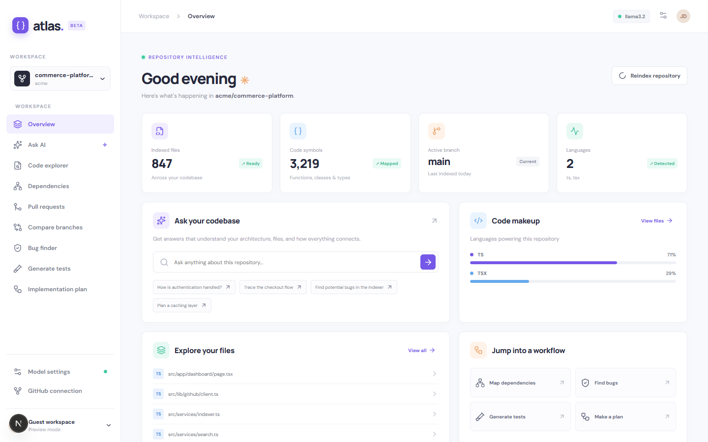
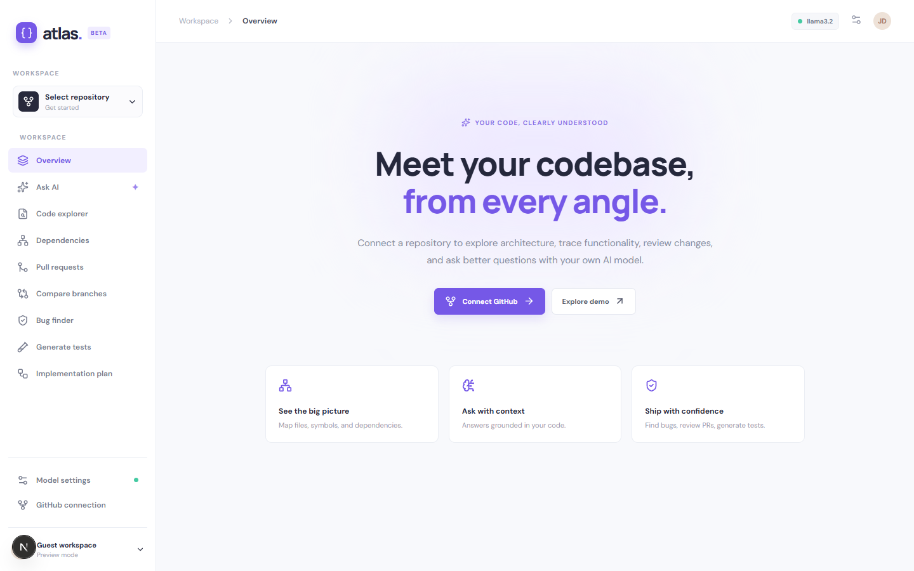
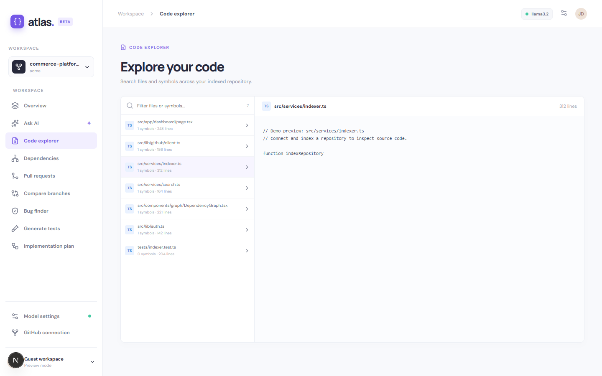

# Atlas — AI Developer Workspace

Atlas is a local-first workspace for exploring GitHub repositories with your own language model. Connect GitHub, index a repository, inspect files and symbols, search code, map imports, compare branches, inspect pull request diffs, and ask codebase-grounded questions. Bug finding, test generation, and implementation planning use the same context pipeline.



## Quick start

### Docker Compose

```bash
docker compose up --build
```

Open [http://localhost:3000](http://localhost:3000). The API docs are at [http://localhost:8000/docs](http://localhost:8000/docs). Compose starts Next.js, FastAPI, PostgreSQL, Redis, and an indexing worker. On Docker Desktop, local Ollama at `http://localhost:11434` is forwarded to `host.docker.internal` by the API. Run `ollama pull llama3.2` before asking questions.

### Without Docker

```bash
npm install
npm run dev
```

In a second terminal:

```bash
python -m pip install -r backend/requirements.txt
cd backend
uvicorn main:app --reload --port 8000
```

This mode uses an in-memory repository index. Set `DATABASE_URL` to a PostgreSQL connection string for durable indexes. The frontend uses `NEXT_PUBLIC_API_URL=http://localhost:8000` by default.

## Connect services

1. Select **Connect GitHub**. Create a fine-grained GitHub token with repository contents read permission and metadata read permission for the repositories you want to analyze. The token remains in browser memory and is sent only to the local API, which uses it to call GitHub. Refreshing the page clears the connection.
2. Choose a repository and select **Index repository**. The API downloads a GitHub archive, extracts supported text files, parses Python with `ast`, extracts TypeScript/JavaScript/Go symbols and imports, and stores the index. Archives are capped at 35 MB and text files at 180 KB each.
3. In **Model settings**, choose **Local Ollama** or **Cloud / API**. The cloud option accepts an OpenAI-compatible chat completions endpoint, model name, and your own API key. Model settings live in this browser's local storage. The key is sent through the local API only when you ask a question; Atlas has no bundled model credential.

## Features

- **Repository overview:** file, symbol, language, and branch summaries.
- **Code explorer:** filter paths and symbols; inspect source.
- **Dependencies:** browse modules and import counts.
- **Search:** local sparse-vector similarity plus path and symbol boosts.
- **Ask AI:** select relevant repository files and cite source paths in model responses.
- **Pull requests:** list open PRs and inspect changed files and patches.
- **Compare branches:** view commit counts and file diffs through the GitHub API.
- **AI workflows:** bug analysis, test generation, and implementation planning.
- **Demo workspace:** preview the interface without a token.

## Architecture

```text
Browser / Next.js  ──► FastAPI ──► GitHub REST API
       │                  │
       │                  ├──► Redis queue ──► indexing worker ──► PostgreSQL
       │                  └──► Ollama or user's OpenAI-compatible endpoint
       └── local model settings and in-memory GitHub token
```

Compose queues indexing jobs in Redis and persists completed indexes in PostgreSQL. Without Compose, indexing runs synchronously and uses an in-memory index. Search uses local sparse vectors rather than an external embedding API. Run `python scripts/evals.py` for a deterministic retrieval evaluation. The API exposes basic request counters and total latency at `/metrics`.

This is a working single-user MVP. It does not implement hosted account authentication, semantic model embeddings, or production-grade distributed telemetry. Treat the local API as a trusted development service and add authentication and endpoint allowlisting before hosting it publicly.

## Screenshots

| Welcome | Dashboard | Code explorer |
| --- | --- | --- |
|  |  |  |

## Stack

Next.js 16, React, TypeScript, FastAPI, Python, PostgreSQL, Redis, Docker Compose, GitHub REST API, Ollama, OpenAI-compatible chat completions.
